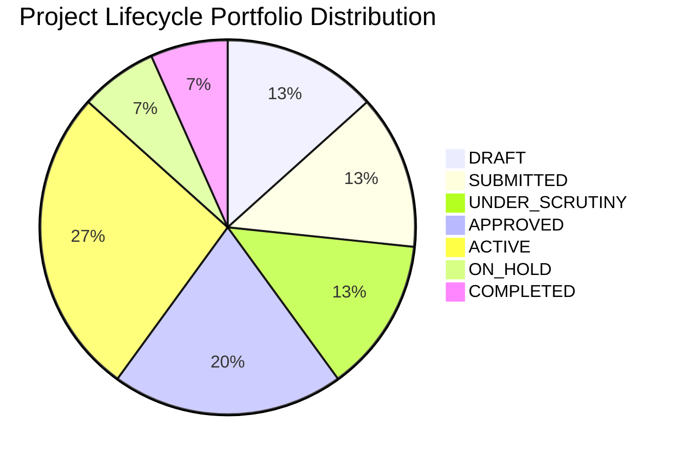

# R-NLAM Synthetic National Demonstration Dataset Documentation

> [!WARNING]
> **SYNTHETIC DEMONSTRATION DATASET — NOT REAL GOVERNMENT RECORDS**  
> All records in this dataset (projects, parcels, landowners, Aadhaar hashes, bank account numbers, UTR reference numbers, and compensation amounts) are artificially generated for system demonstration and testing purposes. No actual citizen PII or real government project data is stored or transferred.

---

## 1. Executive Overview

The **R-NLAM Synthetic National Demonstration Dataset** provides a nationwide, multi-state operating dataset stored in PostgreSQL/PostGIS. Every record forms an unbroken **digital thread** connecting land acquisition proposals, workflow state machines, PostGIS spatial parcel polygons, field officer verifications, compensation treasury disbursements, R&R family benefits, physical land possession certificates, AI risk assessments, and an append-only SHA-256 tamper-evident audit log.

---

## 2. Dataset Metrics Summary

| Domain Category | Seeded Metric Count | Details & Implementation Notes |
| :--- | :---: | :--- |
| **Projects** | **15 National Projects** | Spanning 7 States & 20 Districts across Roads, Railways, Solar, Energy, Ports & Urban sectors. |
| **States Covered** | **7 States** | Maharashtra (`MH`), Uttar Pradesh (`UP`), Rajasthan (`RJ`), Karnataka (`KA`), Madhya Pradesh (`MP`), Gujarat (`GJ`), Odisha (`OD`). |
| **Districts Covered** | **20 Districts** | Nagpur, Pune, Thane, Kanpur Nagar, Gautam Buddha Nagar, Prayagraj, Jaisalmer, Jaipur, Bengaluru Urban, Dakshina Kannada, Indore, Bhopal, Gandhinagar, Kutch, Khordha, Cuttack, etc. |
| **Demo Users** | **25 Active Users** | Covering all 11 system roles (`CENTRAL_ADMIN`, `CENTRAL_OFFICER`, `STATE_ADMIN`, `STATE_OFFICER`, `DISTRICT_OFFICER`, `PIA_OFFICER`, `FIELD_OFFICER`, `RR_OFFICER`, `FINANCE_OFFICER`, `GIS_OFFICER`, `CITIZEN`). |
| **Parcels (GIS)** | **150 Polygon Parcels** | 10 parcels per project with valid closed linear ring GeoJSON polygons in PostGIS. |
| **Proposals & Workflows** | **15 Proposals / 15 Instances** | Connected to RFCTLARR Act 2013 and NH Act 1956 workflow engines + 30 stage transition actions. |
| **Objections & Hearings** | **16 Objections / 16 Hearings** | Land valuation and measurement disputes with scheduled CALA hearings. |
| **Awards & Compensation** | **78 Awards / 78 Cases** | Total Award = Valuation Land + Valuation Assets + Solatium. 42 PFMS treasury payment references (`PFMS_TREASURY_MOCK`). |
| **R&R Entitlements** | **54 Families / 46 Cases** | Resettlement grants and alternative housing units delivered to affected families (`32 Deliveries`). |
| **Possession Certificates** | **35 Certificates** | Physical possession memo records with GPS coordinates (`POSSESSION_TAKEN`, `HANDED_TO_PIA`). |
| **Governance & SLA** | **46 SLA / 61 Milestones** | Statutory deadlines under RFCTLARR Sec 11, 15, 19, 23 & NH Act Sec 3A, 3C, 3D, 3G. |
| **AI Risk Assessments** | **16 Risk Assessments** | 1 per project tracking objection backlog, SLA breaches, and statutory Proximity scores. |
| **Tamper-Evident Audit Log** | **940+ Audit Events** | Cryptographically continuous SHA-256 hash chain (`Event[N].previousHash == Event[N-1].hash`). |

---

## 3. Project Catalog & Lifecycle Distribution



### Complete Project Catalog

| Code | Project Name | Sector | State | Status | Required (ha) | Acquired (ha) | Possessed (ha) |
| :--- | :--- | :--- | :---: | :---: | :---: | :---: | :---: |
| `DEMO-NH-44-NAGPUR` | NH-44 Expansion — Nagpur | Roads | MH | `ACTIVE` | 1,420.0 | 1,037.0 | 876.0 |
| `DEMO-METRO-PUNE` | Pune Metro Line 3 Corridor | Urban | MH | `APPROVED` | 340.0 | 238.0 | 0.0 |
| `DEMO-EXPRESSWAY-MUMBAI` | Konkan Coastal Expressway — Thane | Roads | MH | `DRAFT` | 620.0 | 0.0 | 0.0 |
| `DEMO-DFC-UP-WEST` | DFC — Uttar Pradesh Freight Corridor | Railways | UP | `UNDER_SCRUTINY` | 980.0 | 245.0 | 0.0 |
| `DEMO-AIRPORT-JEWAR` | Jewar International Airport Link | Aviation | UP | `ACTIVE` | 1,250.0 | 875.0 | 525.0 |
| `DEMO-EXPRESSWAY-GANGA` | Ganga Expressway Phase 2 — Prayagraj | Roads | UP | `SUBMITTED` | 1,800.0 | 0.0 | 0.0 |
| `DEMO-RE-SOLAR-RJ` | Solar Energy Park — Jaisalmer | Energy | RJ | `APPROVED` | 2,500.0 | 1,750.0 | 0.0 |
| `DEMO-HIGHWAY-JAIPUR` | Jaipur Ring Road Expansion | Roads | RJ | `ON_HOLD` | 540.0 | 378.0 | 0.0 |
| `DEMO-TECH-HUB-BLR` | Aerospace Park — Bengaluru Urban | Industrial | KA | `COMPLETED` | 850.0 | 850.0 | 850.0 |
| `DEMO-PORT-MANGALORE` | Mangalore Port Railway Link | Ports | KA | `ACTIVE` | 410.0 | 287.0 | 172.2 |
| `DEMO-INDUSTRIAL-INDORE` | Pithampur Industrial Corridor | Industrial | MP | `UNDER_SCRUTINY` | 1,100.0 | 275.0 | 0.0 |
| `DEMO-RAILWAY-BHOPAL` | Bhopal-Indore High Speed Rail Link | Railways | MP | `ACTIVE` | 950.0 | 665.0 | 399.0 |
| `DEMO-GIFT-CITY-EXT` | GIFT City Smart Zone Extension | Urban | GJ | `APPROVED` | 680.0 | 476.0 | 0.0 |
| `DEMO-GREEN-HYDROGEN-GJ` | Kutch Green Hydrogen Energy Zone | Energy | GJ | `DRAFT` | 3,200.0 | 0.0 | 0.0 |
| `DEMO-STEEL-HUB-OD` | Kalinganagar Industrial Link | Industrial | OD | `SUBMITTED` | 1,150.0 | 0.0 | 0.0 |

---

## 4. Land Metrics & Digital Thread Rules

To ensure canonical mathematical consistency:
- **`requiredLand`**: Planned project land area (in hectares).
- **`acquiredLand`**: Sum of `acquiredArea` across verified, awarded, or acquired parcels for that project.
- **`possessedLand`**: Sum of `possessedArea` across physically possessed parcels handed over to the PIA.
- Enforced invariant: $\text{requiredLand} \ge \text{acquiredLand} \ge \text{possessedLand}$.

---

## 5. Demo Command Reference

### Seed Dataset
Populate PostgreSQL/PostGIS idempotently with synthetic records:
```bash
cd backend
npm run seed:demo
```

### Run Automated Validation Suite
Execute 25 automated integrity, geometry, thread, role, and hash chain checks:
```bash
cd backend
npm run validate:demo
```

### Safe Demo Reset
Remove ONLY records marked with `DEMO-` or `SYN-` namespaces while preserving real user records:
```bash
cd backend
npm run seed:demo:reset
```

---

## 6. Simulator & Integration Notice

> [!NOTE]
> External government integrations such as Bhoomi/Bhulekh and PFMS/Treasury remain simulator adapters (`PFMS_TREASURY_MOCK`) in this demonstration environment unless independently connected to authorized live government systems.

